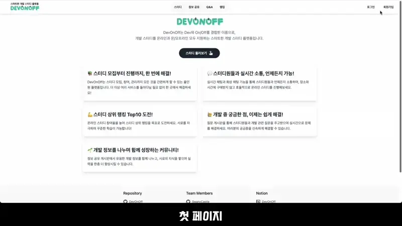
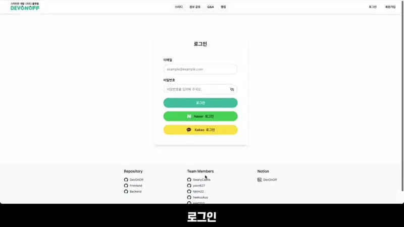
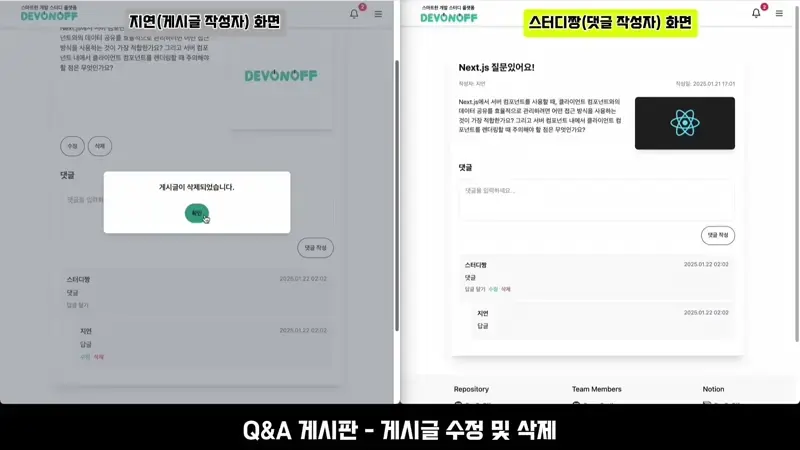
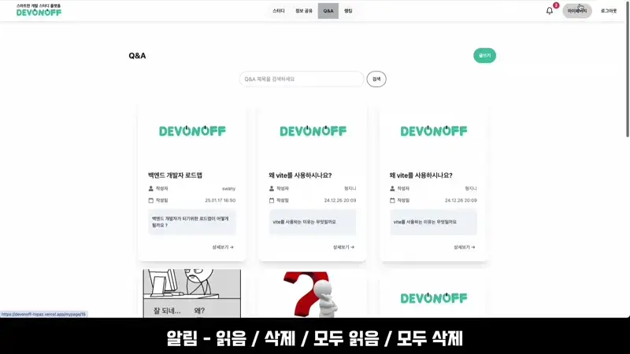
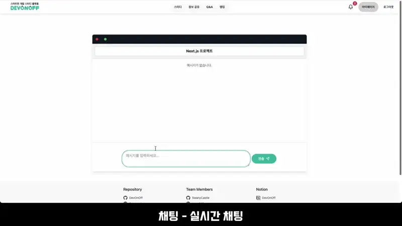

# 🧑‍🏫 DevOnOff

**DevOnOff**는 ‘Dev’와 ‘On/Off’를 결합한 이름으로, 개발 스터디 모집, 참여, 진행 및 관리까지 모든 것을 간편하게 할 수 있는 올인원 개발 스터디 플랫폼입니다.

## 📖 프로젝트 소개

스터디 모집, 참여, 진행 및 관리까지 모든 것을 간편하게 할 수 있는 스마트한 올인원 개발 스터디 플랫폼 **DevOnOff**를 소개합니다!

1. 개발 스터디 모집, 참여, 진행 및 관리까지 한 번에 해결할 수 있습니다.
2. 온라인 스터디 및 온·오프라인 병행 스터디 모집이 가능합니다.
3. 실시간 채팅과 화상 채팅(스터디룸) 기능을 통해 스터디원들과 언제든지 소통하며 온라인 스터디를 효율적으로 진행할 수 있습니다.
4. 학습 시간으로 경쟁하며 스터디 랭킹 상위권에 도전할 수 있어 꾸준한 학습 동기를 부여합니다.
5. Q&A 게시판을 통해 개발 관련 궁금증을 빠르게 해결하고 스터디원들과 지식을 공유할 수 있습니다.
6. 정보 공유 게시판에서 유용한 개발 정보를 나누며 함께 성장할 수 있는 커뮤니티를 제공합니다.

## ✏️ 기획 의도

기존 플랫폼은 스터디 모집은 가능하지만, 참가자를 초대하거나 소통할 때 다른 플랫폼을 사용해야 하는 번거로움이 존재했습니다.
 
DevOnOff는 스터디 모집부터 진행, 관리까지 효율적으로 지원하며, 정보 공유와 Q&A 게시판으로 커뮤니티 활성화를 목표로 합니다.

## 📹 시연 영상

## 🔑 핵심 기능

- 회원가입 및 로그인 ([더 알아보기](https://www.notion.so/DevOnOff-f315721711c84a79ad3e7e3daae98c8b?pvs=4#165dd88aa9ea808cbfa9c01092c3301f))
<table>
      <thead>
        <tr>
          <th align="center">회원가입</th>
          <th align="center">로그인</th>
        </tr>
      </thead>
      <tbody>
        <tr>
          <td align="center">
            
          </td>
          <td align="center">
            
          </td>
        </tr>
      </tbody>
    </table>

- 스터디 게시판 ([더 알아보기](https://www.notion.so/DevOnOff-f315721711c84a79ad3e7e3daae98c8b?pvs=4#165dd88aa9ea805ba6baebee89236715))

<table>
  <thead>
    <tr>
      <th align="center">스터디 게시판 - 온라인</th>
      <th align="center">스터디 게시판 - 온오프라인 병행</th>
    </tr>
  </thead>
  <tbody>
    <tr>
      <td align="center">
        
      </td>
      <td align="center">
        
      </td>
    </tr>
  </tbody>
  <thead>
    <tr>
      <th align="center">스터디 모집 글 작성 - 온라인</th>
      <th align="center">스터디 모집 글 작성 - 온오프라인 병행</th>
    </tr>
  </thead>
  <tbody>
    <tr>
      <td align="center">
        
      </td>
      <td align="center">
        
      </td>
    </tr>
  </tbody>
  <thead>
    <tr>
      <th align="center">스터디 신청</th>
      <th align="center">스터디 신청 수락</th>
    </tr>
  </thead>
  <tbody>
    <tr>
      <td align="center">
        
      </td>
      <td align="center">
        
      </td>
    </tr>
  </tbody>
  <thead>
    <tr>
      <th align="center">스터디 신청 거절</th>
      <th align="center">스터디 모집 마감 후 스터디 개설</th>
    </tr>
  </thead>
  <tbody>
    <tr>
      <td align="center">
        
      </td>
      <td align="center">
        
      </td>
    </tr>
  </tbody>
</table>

- 정보 공유 및 Q&A 게시판([더 알아보기](https://www.notion.so/DevOnOff-f315721711c84a79ad3e7e3daae98c8b?pvs=4#e07afdab17a6408fb1227355c0508056))
<table>
      <thead>
        <tr>
          <th align="center">정보 공유 게시판</th>
          <th align="center">Q&A 게시판</th>
        </tr>
      </thead>
      <tbody>
        <tr>
          <td align="center">
            
          </td>
          <td align="center">
            
          </td>
        </tr>
      </tbody>
    </table>

- 알림 ([더 알아보기](https://www.notion.so/DevOnOff-f315721711c84a79ad3e7e3daae98c8b?pvs=4#165dd88aa9ea80a0a4ebc221ade3b092))
<table>
  <thead>
    <tr>
      <th align="center">알림 조회 및 실시간 알림</th>
    </tr>
  </thead>
  <tbody>
    <tr>
      <td align="center">
        
      </td>
    </tr>
  </tbody>
</table>

- 마이페이지 ([더 알아보기](https://www.notion.so/DevOnOff-f315721711c84a79ad3e7e3daae98c8b?pvs=4#17cdd88aa9ea80788adce9d1d60a9368))
<table>
      <thead>
        <tr>
          <th align="center">회원 정보 수정</th>
          <th align="center">
           속한 스터디 및 작성한 게시글 조회
          </th>
        </tr>
      </thead>
      <tbody>
        <tr>
          <td align="center">
            
          </td>
          <td align="center">
            
          </td>
        </tr>
      </tbody>
    </table>

- 채팅 ([더 알아보기](https://www.notion.so/DevOnOff-f315721711c84a79ad3e7e3daae98c8b?pvs=4#165dd88aa9ea8026bd3ce1c0a47b7745))
<table>
      <thead>
        <tr>
          <th align="center">실시간 채팅</th>
        </tr>
      </thead>
      <tbody>
        <tr>
          <td align="center">
            
          </td>
        </tr>
      </tbody>
    </table>

- 스터디룸 및 랭킹게시판 ([더 알아보기](https://www.notion.so/DevOnOff-f315721711c84a79ad3e7e3daae98c8b?pvs=4#e07afdab17a6408fb1227355c0508056))
<table>
      <thead>
        <tr>
          <th align="center">스터디룸</th>
          <th align="center">스터디 랭킹 조회</th>
        </tr>
      </thead>
      <tbody>
        <tr>
          <td align="center">
            
          </td>
          <td align="center">
            
          </td>
        </tr>
      </tbody>
    </table>

## 🔨 프론트엔드 기술 스택

      
      
      
       
      
      
      
      
       
      
      
       
      
      
       
      
      
      
      
      
    

## 🔨 프론트엔드 아키텍쳐

## 🧑‍🤝‍🧑 팀원 소개

<table>
      <thead>
        <tr>
          <th align="center">
            
          </th>
          <th align="center">
            
          </th>
          <th align="center">
            
          </th>
          <th align="center">
            
          </th>
          <th align="center">
            
          </th>
          <th align="center">
            
          </th>
        </tr>
      </thead>
      <tbody>
        <tr>
          <td align="center">Front-End</td>
          <td align="center">Front-End</td>
          <td align="center">Back-End</td>
          <td align="center">Back-End</td>
          <td align="center">Back-End</td>
          <td align="center">Back-End</td>
        </tr>
        <tr>
          <td align="center">
            <a href="https://github.com/jyeoney">양지연</a>
          </td>
          <td align="center">
            <a href="https://github.com/sim0102">심승태</a>
          </td>
          <td align="center">
            <a href="https://github.com/SwanyCastle">곽승환</a>
          </td>
          <td align="center">
            <a href="https://github.com/hjkim22">김형진</a>
          </td>
          <td align="center">
            <a href="https://github.com/yoon627">이종윤</a>
          </td>
          <td align="center">
            <a href="https://github.com/heekuukuu">이희경</a>
          </td>
        </tr>
      </tbody>
    </table>

## 📑 프로젝트 링크 & 자료

- [**🏡 DevOnOff 바로가기**](https://devonoff-topaz.vercel.app/)

- 🔗 [**DevOnOff 자세히 알아보기**](https://www.notion.so/f315721711c84a79ad3e7e3daae98c8b?pvs=21)

- 📋 [**팀 대시보드**](https://www.notion.so/DevOnOff-142dd88aa9ea809890a2d305aeb9bfc3?pvs=21)

- 📂 [**백엔드 리포지토리**](https://github.com/ZB-DevOnOff/backend)
